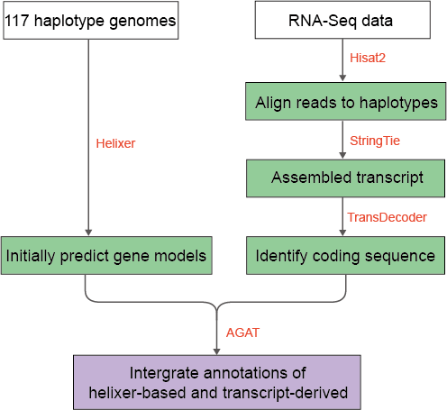

# Genome Annotation 

- [TE annotation](#te-annotation)
- [Gene annotation](#gene-annotation)

------

## TE annotation

The [Extensive de novo TE Annotator](https://github.com/oushujun/EDTA) (EDTA) is developed for automated whole-genome *de-novo* TE annotation and benchmarking the annotation performance of TE libraries.

```shell
EDTA.pl --genome /public/user/database/cassava_genome/${i}_hap.fa --step all --overwrite 1 --anno 1 --threads 25 > ${i}_hap.edta.log 2>&1
```

------

## Gene annotation



We conducted gene model annotation for each haplotype combining *ab initio* predictions and transcriptomic evidence. The annotation process began with generating initial gene predictions using [Helixer](https://github.com/weberlab-hhu/Helixer) (v0.3.3) with the land_plant_v0.3_a_0200.h5 model as the base annotation framework. To improve annotation accuracy, we incorporated transcriptomic evidence from available RNA-seq data and aligned reads to haplotypes using [Hisat2](https://github.com/DaehwanKimLab/hisat2) (v2.2.1) with the --dta parameter. The resulting alignment files were then used for transcript assembly by [StringTie](https://github.com/gpertea/stringtie) (v2.2.1) and coding sequence identification by [TransDecoder](https://github.com/TransDecoder/TransDecoder) (v5.7.1). We used [AGAT](https://github.com/NBISweden/AGAT) (v1.4.0) to integrate the transcript-derived annotations with the Helixer-based predictions. For the AM560 reference genome, we further expanded the transcriptomic evidence by generating new RNA-seq data from a pooled tissue sample encompassing root, stem, bud, and leaf tissues.

```shell
### get helix.gff3
singularity exec -B $PWD --nv ./helixer-docker_helixer_v0.3.3_cuda_11.8.0-cudnn8.sif Helixer.py --fasta-path s100_hap1_2024.04.17.fa --model-filepath ./land_plant_v0.3_a_0200.h5 --subsequence-length 64152 --gff-output-path s100_hap1.helix.gff3

### get gff3 generated based on transcripts evidence

hisat2-build -p 10 s100_hap1_2024.04.17.fa s100_hap1_2024.04.17.fa 1>hisat-build.log 2>hisat2-build.err

# fastp_*.fq.gz generated from RNASeq sample by fastp software
hisat2 --dta -x s100_hap1_2024.04.17.fa --new-summary --summary-file rnaseq.hisat.summary -1 fastp_1.fq.gz -2 fastp_2.fq.gz -p 1|samtools sort -@ 1 -m 2G -o RNASeq.bam - 1>hisat.log 2>hisat.err
stringtie -p 10 -o stringtie.gtf RNASeq.bam
gtf_genome_to_cdna_fasta.pl stringtie.gtf s100_hap1_2024.04.17.fa> transcripts.fasta
gtf_to_alignment_gff3.pl stringtie.gtf > transcripts.gff3
TransDecoder.LongOrfs -t transcripts.fasta
TransDecoder.Predict -t transcripts.fasta
cdna_alignment_orf_to_genome_orf.pl transcripts.fasta.transdecoder.gff3 transcripts.gff3 transcripts.fasta > transcripts.fasta.transdecoder.genome.gff3

### merge helix.gff3 and transcripts.fasta.transdecoder.genome.gff3
source activate AGAT
agat_sp_complement_annotations.pl --ref s100_hap1.helix.gff3 --add transcripts.fasta.transdecoder.genome.gff3 --out s100_hap1_complement.gff3

# filter incomplete gene (<100aa, lack initial START codon and terminal codon),keep the longest transcript
gffread --keep-genes -J -g s100_hap1_2024.04.17.fa -o s100_hap1_complement_gffread.gff3 s100_hap1_complement.gff3
agat_sp_filter_by_ORF_size.pl --gff s100_hap1_complement_gffread.gff3 -s 99 -o s100_hap1_complete_gffread_gt50.gff3
agat_sp_keep_longest_isoform.pl -gff s100_hap1_completeread_gt503_sup99.gff -o s100_hap1_complete_longest.gff

# rename gene id
agat_sp_manage_IDs.pl --gff s100_hap1_complete_longest.gff --prefix s100HA_01g  --type_dependent --tair --nb 00001 -p all -o s100_hap1.gff3
perl rename.pl s100_hap1.gff3 > s100_hap1.final.gff3
```

rename.pl

```perl
#!/usr/bin/perl
open IN,"$ARGV[0]" or die;

while(<IN>){
#chomp;
my @line=split/\t/;
$line[0]=~/chr(\d\d)/;
my $chr=$1;
$line[8]=~/.+?g(.+?)[\D\n]/;
my $num=$1*10;$len=length($num);
my $dif="0" x (6-$len);
my $last=join("",($dif,$num));
#if($num<10){$num=$num*10}elsif($num<100){$num=$num*100}elsif($num<1000){$num=$num}
$_ =~ s/_\d\dg(.+?)(\D)/_${chr}g${last}$2/g;print $_}


close IN;
```