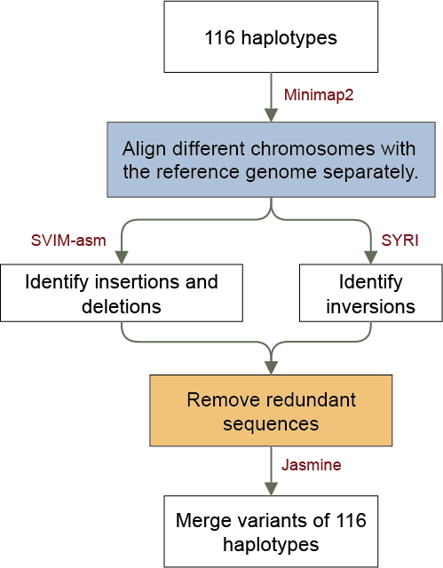

# Structural Variants (SV) Identification

- [Identification based on alignment](#identification-based-on-alignment)
  - [Haplotypes alignment](#haplotypes-alignment)
  - [SVs identification using SVIM-asm](#svs-identification-using-svim-asm)
  - [Inversions identification using SYRI](#inversions-identification-using-syri)
  - [Statistics of SVs](#statistics-of-svs)
  - [Variant merging with Jasmine](#variant-merging-with-jasmine)
- [Multiallelic variants](#multiallelic-variants)

------

## Identification based on alignment

Haplotypes were aligned to the AM560 reference genome using [Minimap2](https://github.com/lh3/minimap2) (v2.26). SV calling (from 50 bp to 1 Mb) was performed on these alignments using [SVIM-asm](https://github.com/eldariont/svim-asm) (v1.0.3), and we classified five distinct SV types: deletions (DELs), insertions (INSs), tandem duplications (DUPs:TANDEM), interspersed duplications (DUPs:INT), and inversions (INVs). To identify large-scale inversions (>1 Mb), we additionally employed [SYRI](https://github.com/schneebergerlab/syri) (v1.7.0) based on the same alignments. These large INVs were subsequently visualized and validated using Hi-C contact maps. Finally, all identified SVs were merged into a non-redundant, population-level SV dataset using [Jasmine](https://github.com/mkirsche/Jasmine) (v1.1.5).



### Haplotypes alignment

```shell
minimap2 -ax asm20 -t 5 --eqx --cs -r 2k -o ${sample}.sam $ref.${chr} ${sample}.${chr}.fa 
samtools sort -O BAM -@ 5 ${sample}.sam -o ${sample}.bam
samtools index /public/home/bam_file/${sample}.bam
```

### SVs identification using SVIM-asm

```shell
svim-asm haploid /home/svim/${sample}/ /home/bam_file/${sample}.bam $ref
```

### Inversions identification using SYRI

```shell
python3 /home/syri_env/bin/syri -c ${sample}.bam -r $ref -q ${sample}.fa -k -F B
python3 /home/syri_env/bin/plotsr ${sample}.out $ref ${sample}.fa -H 8 -W 5
```

### Statistics of SVs

```shell
grep  -v '^#' ${sample}_${hap}.svasm.vcf > ${sample}_${hap}.nohead.vcf

awk '{print $1 "\t" $2 "\t" $8}' ${sample}_${hap}.nohead.vcf >  ${sample}_${hap}.SV.info.txt

awk -F'=|;' '{print $1 "\t" $2 "\t" $4 "\t" $6}' ${sample}_${hap}.SV.info.txt > ${sample}_${hap}.SV.info2.txt

awk '{print $1 "\t" $2 "\t" $5 "\t" $4 "\t" $6}' ${sample}_${hap}.SV.info2.txt > ${sample}_${hap}.SV.info3.txt

grep 'DEL' ${sample}_${hap}.SV.info3.txt > ${sample}_${hap}.DEL.txt
grep 'INS' ${sample}_${hap}.SV.info3.txt > ${sample}_${hap}.INS.txt
grep 'INV' ${sample}_${hap}.SV.info3.txt > ${sample}_${hap}.INV.txt
grep 'DUP' ${sample}_${hap}.SV.info3.txt > ${sample}_${hap}.DUP.txt
grep 'TANDEM' ${sample}_${hap}.SV.info3.txt > ${sample}_${hap}.TANDEM.txt
grep 'INT' ${sample}_${hap}.SV.info3.txt > ${sample}_${hap}.INT.txt

python /public/home/yangyuting/scripts/04.python/SV_merge_overlap.py ${sample}_${hap}.DEL.txt > ${sample}_${hap}.DEL.no_lap.txt
python /public/home/yangyuting/scripts/04.python/SV_merge_overlap.py ${sample}_${hap}.INV.txt > ${sample}_${hap}.INV.no_lap.txt
python /public/home/yangyuting/scripts/04.python/SV_merge_overlap.py ${sample}_${hap}.DUP.txt > ${sample}_${hap}.DUP.no_lap.txt
python /public/home/yangyuting/scripts/04.python/SV_merge_overlap.py ${sample}_${hap}.TANDEM.txt > ${sample}_${hap}.TANDEM.no_lap.txt
python /public/home/yangyuting/scripts/04.python/SV_merge_overlap.py ${sample}_${hap}.INT.txt > ${sample}_${hap}.INT.no_lap.txt
python /public/home/yangyuting/scripts/04.python/SV_INS_redup.py ${sample}_${hap}.INS.txt > ${sample}_${hap}.INS.no_lap2.txt

awk '{print $0, $3 - $2 + 1}' ${sample}_${hap}.DEL.no_lap.txt > ${sample}_${hap}.DEL.no_lap2.txt
awk '{print $0, $3 - $2 + 1}' ${sample}_${hap}.INV.no_lap.txt > ${sample}_${hap}.INV.no_lap2.txt
awk '{print $0, $3 - $2 + 1}' ${sample}_${hap}.DUP.no_lap.txt > ${sample}_${hap}.DUP.no_lap2.txt
awk '{print $0, $3 - $2 + 1}' ${sample}_${hap}.TANDEM.no_lap.txt > ${sample}_${hap}.TANDEM.no_lap2.txt
awk '{print $0, $3 - $2 + 1}' ${sample}_${hap}.INT.no_lap.txt > ${sample}_${hap}.INT.no_lap2.txt

awk '$5 > 50  {print $0}' ${sample}_${hap}.DEL.no_lap2.txt > ${sample}_${hap}.DEL_f.txt
awk '$5 > 50  {print $0}' ${sample}_${hap}.INS.txt > ${sample}_${hap}.INS_f.txt
awk '$5 > 50  {print $0}' ${sample}_${hap}.INV.no_lap2.txt > ${sample}_${hap}.INV_f.txt
awk '$5 > 50  {print $0}' ${sample}_${hap}.DUP.no_lap2.txt > ${sample}_${hap}.DUP_f.txt
awk '$5 > 50  {print $0}' ${sample}_${hap}.TANDEM.no_lap2.txt > ${sample}_${hap}.TANDEM_f.txt
awk '$5 > 50  {print $0}' ${sample}_${hap}.INT.no_lap2.txt > ${sample}_${hap}.INT_f.txt

rm *.length.txt
rm *.count.txt

awk '{sum[$1] += $5} END {for (sv in sum) print sv, sum[sv]}' ${sample}_${hap}.DEL_f.txt >> ${sample}_${hap}.DEL_f.length.txt
awk '{sum[$1] += $5} END {for (sv in sum) print sv, sum[sv]}' ${sample}_${hap}.INS_f.txt >> ${sample}_${hap}.INS_f.length.txt
awk '{sum[$1] += $5} END {for (sv in sum) print sv, sum[sv]}' ${sample}_${hap}.DUP_f.txt >> ${sample}_${hap}.DUP_f.length.txt
awk '{sum[$1] += $5} END {for (sv in sum) print sv, sum[sv]}' ${sample}_${hap}.INV_f.txt >> ${sample}_${hap}.INV_f.length.txt
awk '{sum[$1] += $5} END {for (sv in sum) print sv, sum[sv]}' ${sample}_${hap}.TANDEM_f.txt >> ${sample}_${hap}.TANDEM_f.length.txt
awk '{sum[$1] += $5} END {for (sv in sum) print sv, sum[sv]}' ${sample}_${hap}.INT_f.txt >> ${sample}_${hap}.INT_f.length.txt

awk '{count[$1]++} END {for (sv in count) print sv, count[sv]}' ${sample}_${hap}.DEL_f.txt >> ${sample}_${hap}.DEL_f.count.txt
awk '{count[$1]++} END {for (sv in count) print sv, count[sv]}' ${sample}_${hap}.INS_f.txt >> ${sample}_${hap}.INS_f.count.txt
awk '{count[$1]++} END {for (sv in count) print sv, count[sv]}' ${sample}_${hap}.DUP_f.txt >> ${sample}_${hap}.DUP_f.count.txt
awk '{count[$1]++} END {for (sv in count) print sv, count[sv]}' ${sample}_${hap}.INV_f.txt >> ${sample}_${hap}.INV_f.count.txt
awk '{count[$1]++} END {for (sv in count) print sv, count[sv]}' ${sample}_${hap}.TANDEM_f.txt >> ${sample}_${hap}.TANDEM_f.count.txt
awk '{count[$1]++} END {for (sv in count) print sv, count[sv]}' ${sample}_${hap}.INT_f.txt >> ${sample}_${hap}.INT_f.count.txt
```

### Variant merging with Jasmine

```shell
mkdir ${chr}_Jasmine
cd ${chr}_Jasmine
cp /home/SVIMasm_chr/*.${chr}.vcf .
ls *.${chr}.vcf > ${chr}_filelist.txt
jasmine --output_genotypes file_list=${chr}_filelist.txt out_file=${chr}_merged.vcf
jasmine --dup_to_ins --postprocess_only out_file=${chr}_merged.vcf
rm *.${chr}.vcf
sort -k2 -n ${chr}_merged.vcf > ${chr}_merged.sorted.vcf
grep -v 'BND' ${chr}_merged.sorted.vcf > ${chr}_merged.sorted.noBND.vcf
#The 'length50.awk' script is shown below:
awk -f /home/scripts/length50.awk ${chr}_merged.sorted.noBND.vcf > ${chr}_result.vcf
cd ..
```

###### length50.awk

```shell
{
if ($0 ~ /^#/) {
print $0;
} else if ($0 ~ /AVG_LEN=/) {
match($0, /AVG_LEN=([-]?[0-9]+)/, arr);
if (arr[1] && (arr[1] > 50 || arr[1] < -50 || arr[1] = 0 )) {
print $0;
}
}
```

------

## Multiallelic variants

We used the [vg](https://github.com/vgteam/vg) program to deconstruct the [PGGB](https://github.com/pangenome/pggb) pangenome graph and generate a VCF file containing variant types and positions based on the AM560 reference genome. The VCF files from different chromosomes were merged into a single file. Variants were categorized by length: SNPs were defined as single-base differences between reference and alternative alleles; InDels included at least one allele longer than 1 bp but shorter than 50 bp; and SVs encompassed at least one allele exceeding 50 bp. Variant classification was performed using [bcftools](https://github.com/samtools/bcftools) and [svpack](https://github.com/PacificBiosciences/svpack). Multiallelic site statistics were generated using the bcftools stat module, with the multiallelic proportion calculated as the number of multiallelic sites divided by the total number of recorded sites.

```shell
vg deconstruct -P AM560 -H "#" -e -a -t 40 PGGB.gfa > PGGB_AM560.vcf
#Filtering SNPs
vcftools --vcf ${i}.vcf --recode --stdout --remove-indels > ${i}.only.SNPs.vcf
#Filtering Non-SNPs
vcftools --vcf ${i}.vcf --recode --stdout --keep-indels > ${i}.INDELs_SVs.vcf
#Filtering SVs (>50bp)​
svpack filter -l 50 ${i}.INDELs_SVs.vcf > ${i}.SVs.vcf.vcf
#Filtering Indels (2-50bp)​
bgzip ${i}.INDELs_SVs.vcf
tabix -p vcf ${i}.INDELs_SVs.vcf.gz
/home/wangnan/Software/vcfbub -i ${i}.INDELs_SVs.vcf.gz -a 50 -l 0 > ${i}.INDELs.vcf
#Statistics for multiallelic and variant counts​
bcftools stats  -s - input.vcf > input.stat
#Alternative, normalizing different VCF types with bcftools norm
bcftools norm -m- input.vcf -Ov -o output.vcf
```

