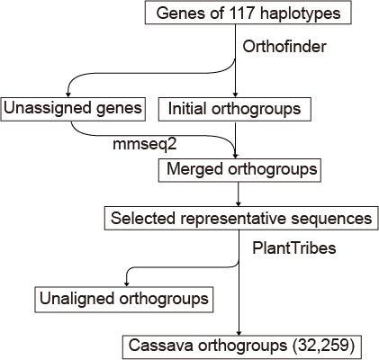

# Gene duplication

- [Orthogroups](#orthogroups)
- [Duplication events](#duplication-events)

------

## Orthogroups

To analyze homologous relationships among the 117 cassava haplotypes (excluding the two Manihot glaziovii haplotypes), the longest transcript of each predicted gene in each haplotype was selected as a representative for subsequent analysis. An all-against-all comparison was then performed using [Diamond](https://github.com/bbuchfink/diamond) (v2.1.11) with an e-value threshold of 1×10^(-5), followed by clustering using [OrthoFinder](https://github.com/davidemms/OrthoFinder) (v.2.5.2) with default parameters. Genes that were not classified into orthogroups by OrthoFinder underwent reclustering with [MMseqs2](https://github.com/soedinglab/MMseqs2).

To enhance data accuracy, we implemented a multi-level filtering approach. Protein sequences shorter than 100 amino acids were excluded to prevent the absence of Pfam annotations. To remove genes associated with transposons or annotated as hypothetical proteins, we classified protein sequences using the [PlantTribes pipeline](https://github.com/dePamphilis/PlantTribes), which assigns gene sequences to predefined plant orthologous gene family clusters. Furthermore, hypothetical proteins lacking supporting evidence from the 22Gv1.1 protein database, encompassing 22 plant species genomes, were further filtered out. 

Based on the clustering results, gene families shared among all samples were defined as core gene families. Gene families present in more than 70% of the haplotypes (covering 82 to 116 haplotypes) were defined as near-core gene families, while those present in one individual and less than 70% of the haplotypes (covering 2 to 81 haplotypes) were considered dispensable gene families. Private gene families were defined as those exclusively present in only one of the 117 cassava haplotypes.



```shell
# orthofinder
~/software/OrthoFinder/orthofinder.py -f ortho_result -a 30 -t 120 -M msa -ot

# mmseq2
mmseqs easy-cluster Unassigned.fasta clusterRes tmp --min-seq-id 0.5 -c 0.8 --cov-mode 1

# selected representative sequences
cat list | parallel -j 10 'python abstract_first_sequence.py ~/ortho_result/OrthoFinder/Results_Sep07/Orthogroup_Sequences/{} >> og_fasta.fa'

#PlantTribes
~/PlantTribes-master/pipelines/GeneFamilyClassifier --proteins og_fasta.fa --scaffold 22Gv1.1 --method orthofinder --classifier both --num_threads 30

```

###### abstract_first_sequence.py

```python
import argparse

def extract_first_fasta_sequence(fasta_file):
    with open(fasta_file, 'r') as file:
        fasta_data = file.read()
    sequences = fasta_data.split(">")[1:]  
    first_sequence = sequences[0].strip()  
    identifier, sequence = first_sequence.split("\n", 1)
    sequence = sequence.replace("\n", "")  
    return identifier, sequence

def main():
    parser = argparse.ArgumentParser(description="Extract the first sequence from a FASTA file.")
    parser.add_argument("fasta_file", help="The path to the FASTA file.")
    args = parser.parse_args()
    identifier, sequence = extract_first_fasta_sequence(args.fasta_file)
    print(f">{identifier}")
    print(f"{sequence}")

if __name__ == "__main__":
    main()
```


## Duplication events

We utilized the [DupGen_finder](https://github.com/qiao-xin/DupGen_finder) to identify different modes of gene duplication in the cassava genome, including whole-genome duplication, tandem duplication proximal duplication, transposed duplication, and dispersed duplication. For each haplotype, we performed an all-against-all alignment using Blastp, and the MCScanX algorithm was integrated into the DupGen_finder pipeline to identify collinear gene pairs and blocks. Genes without detected pairs were classified as single genes. Since no outgroup was set, transposed duplication was not included in the statistics. We employed the DupGen_finder-unique.pl module to assign each duplicated gene pair a unique duplication type, following the default prioritization rules: whole-genome duplication > tandem > proximal > dispersed.

```shell
mkdir data
cd data
makeblastdb -in ${PEP}/${i}.pep -dbtype prot -title ${i} -parse_seqids -out ${i}
blastp -query ${PEP}/${i}.pep -db ${i} -evalue 1e-10 -max_target_seqs 5 -outfmt 6 -out ${i}.blast -num_threads $threads
cat ${PEP}/${i}.gff3 | grep -w "gene" | awk '{print \$1 "\t" \$9 "\t" \$4 "\t" \$5}' | sed 's/ID=//g' > ${i}.gff
cp ${i}.gff ${i}_${i}.gff
awk '{gsub(/\.[0-9]+$/, "", \$1); gsub(/\.[0-9]+$/, "", \$2); print \$1 "\t" \$2 "\t" \$3 "\t" \$4 "\t" \$5 "\t" \$6 "\t" \$7 "\t" \$8 "\t" \$9 "\t"  \$10  "\t" \$11 "\t" \$12}' ${i}.blast > ${i}_${i}.blast
cp  ${i}_${i}.blast ${i}.blast
cd ..

#run duplication gene with unique type
DupGen_finder-unique.pl -i data -t ${i} -c ${i} -o results_uniq
```

