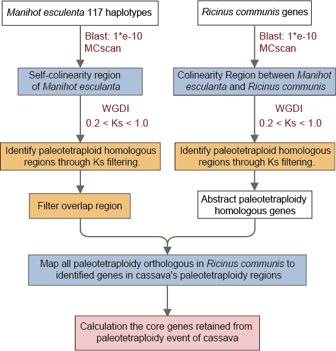

# Paleotetraploid Event



- [Whole-genome duplication (WGD) events](#whole-genome-duplication-wgd-events)
  - [All-against-all protein sequence self-alignment](#all-against-all-protein-sequence-self-alignment)
  - [Homologous gene pairs identification](#homologous-gene-pairs-identification)
  - [Ks peakfit](#ks-peakfit)
  - [Evaluation of paleotetraploid event time](#evaluation-of-paleotetraploid-event-time)
- [Karyotype reconstruction](#karyotype-reconstruction)
  - [All-against-all protein sequence alignment between cassava and Ricinus communis](#all-against-all-protein-sequence-alignment-between-cassava-and-ricinus-communis)
  - [Paleotetraploid homologous genes identification](#paleotetraploid-homologous-genes-identification)
  - [Karyotype reconstruction](#karyotype-reconstruction-1)
- [Paleotetraploid core genes identification](#paleotetraploid-core-genes-identification)
  - [Self-syntenic region identification](#self-syntenic-region-identification)
  - [Paleotetraploidy orthologous identification](#paleotetraploidy-orthologous-identification)
  - [All paleotetraploidy orthologous to self-syntenic region mapping](#all-paleotetraploidy-orthologous-to-self-syntenic-region-mapping)
  - [Paleotetraploid core genes calculation](#paleotetraploid-core-genes-calculation)

------

## Whole-genome duplication (WGD) events

We focused on the AM560 reference genome as a representative model for WGD analysis in cassava. First, we conducted an all-against-all protein sequence alignment to identify homologous gene pairs (blocks). We then calculated the Ks values for each homologous gene pair within these blocks using [WGDI](https://github.com/SunPengChuan/wgdi) software. The median Ks value of each block was used as the representative Ks value. To characterize WGD patterns, we visualized the combined Ks values from all blocks as a distribution plot. Additionally, we analyzed genomic data from *Ricinus communis*, *Hevea brasiliensis*, and *Vitis vinifera*, calculating their Ks distributions. To further explore evolutionary dynamics, we conducted pairwise comparisons between different species, including *Ricinus communis*-cassava and *Ricinus communis*-*Hevea brasiliensis*.

### All-against-all protein sequence self-alignment

```shell
ln -s $DATA/data/${i}.gff3 .
ln -s $DATA/data/${i}.fa .
ln -s $DATA/data/${i}.pep.fa ${i}.pep.fa
ln -s $DATA/data/${i}.cds.fa ${i}.cds.fa

python 01.getgff.py ${i}.gff3 temp.gff
python 02.gff_lens.py temp.gff ${i}.gff ${i}.len
python 03.seq_newname.py ${i}.gff ${i}.pep.fa ${i}.pep
python 03.seq_newname.py ${i}.gff ${i}.cds.fa ${i}.cds

mkdir tmp
mv temp.gff ./tmp
mv ${i}.pep.fa ./tmp
mv ${i}.cds.fa ./tmp

cp ${i}.pep ./tmp
cd tmp
makeblastdb -in ${i}.pep -dbtype prot -out ${i}_pep
blastp  -query ${i}.pep -db ${i}_pep -out ${i}_${i}_pep.blast -evalue 1e-10 -num_threads $threads -outfmt 6 

cd ..
mv ./tmp/${i}_${i}_pep.blast ${i}_${i}.blast
```

### Homologous gene pairs identification

```shell
# Using AM560 as an example,its *conf configuration files are included in the same directory as README.md.
wgdi -d ${i}_dot.conf
wgdi -icl ${i}_syn.conf
wgdi -ks ${i}_ks.conf
wgdi -bi ${i}_bi.conf
wgdi -bk ${i}_bk.conf
wgdi -kp ${i}_kp.conf
```

### Ks peakfit

```shell
wgdi -kf Ks_kf.conf
```

------

## Paleotetraploid karyotype reconstruction

To reconstruct the ancestral karyotype of cassava and investigate homologous regions, we used the *Ricinus communis* genome (with ten chromosomes) as a comparative baseline. Synteny blocks, derived from protein sequence alignments between cassava and *Ricinus communis*, were anchored based on the chromosomal orientation in *Ricinus communis*. We then mapped the *Ricinus communis* genome onto the cassava genome using the WGDI toolkit.

### All-against-all protein sequence alignment between cassava and *Ricinus communis*

```shell
python 01.getgff.py ${i}.gff3 temp.gff
python 02.gff_lens.py temp.gff ${i}.gff ${i}.len
python 03.seq_newname.py ${i}.gff ${i}.pep.fa ${i}.pep
python 03.seq_newname.py ${i}.gff ${i}.cds.fa ${i}.cds

mkdir tmp
mv temp.gff ./tmp
mv ${i}.pep.fa ./tmp
mv ${i}.cds.fa ./tmp

cp ${i}.pep ./tmp
cd tmp
makeblastdb -in castor.pep -dbtype prot -out castor_pep
blastp  -query ${i}.pep -db castor_pep -out ${i}_castor_pep.blast -evalue 1e-10 -num_threads $threads -outfmt 6 

cd ..
mv ./tmp/${i}_castor_pep.blast ${i}_castor.blast
```

### Paleotetraploid homologous genes identification

```
wgdi -d Pale_${i}_dot.conf
wgdi -icl Pale_${i}_syn.conf
wgdi -ks Pale_${i}_ks.conf
wgdi -bi Pale_${i}_bi.conf
wgdi -bk Pale_${i}_bk.conf
wgdi -kp Pale_${i}_kp.conf
wgdi -kp Pale_${i}_kp_0.2_1.conf
wgdi -pf Pale_${i}_pf_0.2_1.conf > Pale_${i}_pf_0.2_1.curve.parameter
```

### Karyotype reconstruction

```
wgdi -km ${i}_km.conf
wgdi -k ${i}_k.conf
```

------

## Paleotetraploid core genes identification

### Self-syntenic region identification

After performing self-alignment of all cassava genomes, identify blocks of tetraploidization events with Ks values between 0.2 and 1.0, and finally filter out overlapping regions between the blocks.

```shell
awk -F',' '{print $1 "," $2 "," $3 "," $4 "," $5 "," $6 "," $7}' AM560.ks_0.2_1.distrubution.csv > AM560.ks_0.2_1.block.csv

### filter same block
awk -F, 'BEGIN {OFS=","} 
{
        chr1_num = substr($2, length($2)-1, 2)
        chr2_num = substr($3, length($3)-1, 2)
        if (chr1_num <= chr2_num) {
                print $0
                }
}' AM560.ks_0.2_1.block.csv > AM560.ks_0.2_1.block_filter.csv

### filter overlap block (local inversion)
python ./filter_overlap.py AM560.ks_0.2_1.block_filter.csv AM560.ks_0.2_1.block_filter2.csv
```

### Paleotetraploidy orthologous identification

To identify paleotetraploid genes in both cassava and *Ricinus communis*, we performed pairwise alignments between all cassava haplotypes and *Ricinus communis* genome, obtaining cassava-*Ricinus* homologous genes with Ks values between 0.2 and 1. 

```shell
grep -v '#' AM560_castor.collinearity.txt > AM560_castor.collinearity_pair.txt
python WGD_1_to_2.py AM560_castor.collinearity_pair.txt AM560_1_2.txt
awk '{print $1 "\t" $2 "\t" $3 "\t" $4}' AM560_1_2.txt > AM560_1_2_4col.txt
awk -F',' '{print $1 "," $2 "," $3 "," $17 "," $18}' AM560.ks_0.2_1.distrubution.csv > AM560_ks_gene_number.csv
python WGD_id_add.py   -a AM560_1_2_4col.txt -b AM560_ks_gene_number.csv -o AM560_1_2_4col_add_id.txt
grep -v 'UNID' AM560_1_2_4col_add_id.txt > AM560_1_2_4col_add_id_ks.txt
awk -F',' '{print $1 "," $2 "," $3 "," $17 "," $18}' AM560.ks_0.2_1.distrubution.csv > castor_AM560_ks0.2_1.0_pair.csv

awk '{
    split($1, a, /[g]/); 
    chrom1 = substr(a[1], 3);  
    split($3, b, /[g]/); 
    chrom2 = substr(b[1], 3);
    print chrom1, $1, $2, chrom2, $3, $4
}' OFS='\t' AM560_castor.collinearity_pair.txt > AM560_castor.collinearity_pair_chr.txt

python cassava_castor_ks_0.2_1.0_gene.py AM560_castor.collinearity_pair_chr.txt castor_AM560_ks0.2_1.0_pair.csv AM560_castor_ks_0.2_1.0_gene.txt
```

### All paleotetraploidy orthologous to self-syntenic region mapping

```shell
python ./unfold_block_gene.py AM560.ks_0.2_1.block_filter2.csv AM560_block_expanded_data.csv
python ./gene_ID_gene_name.py AM560_block_expanded_data.csv AM560_block_expanded_data_gene_name.csv
awk 'BEGIN { OFS="," }
     NR==FNR {
                 FS = "\t";
                 $0 = $0;  
                 map[$2] = $3;
                 next;
                 }
                 {
                 FS = ",";
                 $0 = $0;  
                 if ($NF in map) {
                     print $0, map[$NF];
                 } else {
                     print $0;
                 }
        }'  ~/WGDI_castor_cassava/AM560/AM560_castor_ks_0.2_1.0_gene.txt AM560_block_expanded_data_gene_name.csv  > AM560_block_result.csv

sed '1d' AM560_block_result.csv  > AM560_block_result_tmp.csv 
echo 'id,species,chr,start,end,gene,castor_gene' > AM560_block_result_head.csv
cat AM560_block_result_tmp.csv >> AM560_block_result_head.csv
rm AM560_block_result_tmp.csv

python ./castor_homologuos.py AM560_block_result_head.csv AM560_block_result_merge_tmp.csv
awk -F, '!seen[$7]++' AM560_block_result_merge_tmp.csv  > AM560_block_result_merge.csv 

python ./castor_homologuos_type.py AM560_block_result_merge.csv castor.gff AM560_block_result_type_filter_overlap.csv
```

### Paleotetraploid core genes calculation

Core genes were defined as those either completely retained in one homologous block (homologous1 or homologous2) and absent in the ather across all haplotypes, or retained in both blocks. Among these, genes were further classified as core and variable based on their retention patterns. All the generated *_block_result_type_filter_overlap.csv sample files into the input_file directory. Upon executing the following command, the final output file statistics_output.csv will contain four columns:

1. *Ricinus communis* gene ID

2. Number of retained paleotetraploid genes in homologous1

3. Number of retained paleotetraploid genes in homologous2

4. Core gene classification:

   - 1: Core genes specific to homologous1 (Homologous1-core)

   - 2: Core genes specific to homologous2 (Homologous2-core)

   - B: Core genes shared by both homologous1 and homologous2 (Both-core)
   
   - V: Variable genes
   
   - None: No homologous genes in cassava

```shell
python panwgd_merge.py input_file/ output.csv
python panwgd_stat.py output.csv statistics_output.csv
```


------

