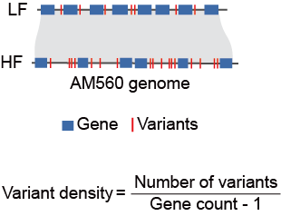

# Biased Fractionation

- [Gene retention](#gene-retention)
  - [The input file format](#the-input-file-format-for-gene-retention-visualization-is-as-follows)
  - [Gene retention calculation and visualization](#gene-retention-calculation-and-visualization)
- [Unbalanced gene retention region identification](#unbalanced-gene-retention-region-identification)

- [Assess differences in LF and HF region](#assess-differences-in-lf-and-hf-region)
  - [TE content](#te-content)
  - [Site frequency spectrum (SFS) analysis](#site-frequency-spectrum-sfs-analysis)
  - [Variant density](#variant-density)

------

## Gene retention

To visualize gene retention patterns, we plotted a gene retention line plot based on homologous1-core, homologous2-core, and both-core genes. We used a sliding window approach, with each window consisting of 100 core genes and sliding every 10 genes. Within each window, we calculated the gene retention rates as follows:

1. Homologous1-core retention rate: (Number of homologous1-core + Number of both-core) / 100.
2. Homologous2-core retention rate: (Number of homologous2-core + Number of both-core) / 100.
3. Both-core retention rate: (Number of both-core) / 100.

This approach allows us to analyze and compare gene retention patterns across homologous blocks based on the Ricinus communis genome. 

### The input file format for gene retention visualization is as follows:

| NC_063256.1 | mdNC_063256.1g00001 | None |
| :---------: | ------------------- | :--: |
| NC_063256.1 | mdNC_063256.1g00002 |  V   |
| NC_063256.1 | mdNC_063256.1g00003 |  1   |
| NC_063256.1 | mdNC_063256.1g00004 |  2   |
| NC_063256.1 | mdNC_063256.1g00005 |  B   |

### Gene retention calculation and visualization 

```R
# R language
library(dplyr)
library(ggplot2)
library(tidyr)

# Input file
file_path <- "core_gene_retention.csv" 
data <- read.csv(file_path, header = FALSE, stringsAsFactors = FALSE)

# Rename column
colnames(data) <- c("Chromosome", "GeneID", "Status")
data <- data %>% filter(Status != "None")
data <- data %>% filter(Status != "V")
# Grouped by chromosomes
chromosomes <- unique(data$Chromosome)

# Create output folder
output_folder <- gsub(".csv", "", basename(file_path))
dir.create(output_folder, showWarnings = FALSE)

# Define the sliding window function
sliding_window <- function(data, window_size, step) {
  n <- nrow(data)
  starts <- seq(1, n - window_size + 1, by = step)
  ends <- starts + window_size - 1
  result <- lapply(1:length(starts), function(i) {
    window_data <- data[starts[i]:ends[i], ]
    count_1 <- sum(window_data$Status == "1" | window_data$Status == "B")
    count_2 <- sum(window_data$Status == "2" | window_data$Status == "B")
    count_B <- sum(window_data$Status == "B")
    total <- nrow(window_data)
    data.frame(
      Start = starts[i],
      End = ends[i],
      Prop_1 = count_1 / total,
      Prop_2 = count_2 / total,
      Prop_B = count_B / total
    )
  })
  do.call(rbind, result)
}

# Process each chromosome separately
for (chr in chromosomes) {
  chr_data <- data %>% filter(Chromosome == chr)
  window_results <- sliding_window(chr_data, window_size = 100, step = 10)
  
  # plot
  p <- window_results %>%
    pivot_longer(cols = starts_with("Prop_"), names_to = "Status", values_to = "Proportion") %>%
    ggplot(aes(x = Start, y = Proportion, color = Status)) +
    geom_line() +
    labs(title = paste("Chromosome:", chr), x = "Gene Position", y = "Proportion") +
    scale_y_continuous(limits = c(0, 1), breaks = seq(0, 1, by = 0.2)) +
    theme_bw()
  
  # save
  ggsave(filename = file.path(output_folder, paste0(chr, ".pdf")), plot = p, width = 10, height = 6)
}
```


------

## Unbalanced gene retention region identification

We identified unbalanced gene retention by comparing core gene retention rates. Regions exhibiting unbalanced gene retention were defined as biased regions. The absolute difference in core gene retention rates between homologous1 and homologous2 was assessed. A high-resolution approach using a 20-core gene sliding window, advancing every 5 genes, was employed to identify biased fractionation. A threshold of 0.15 was used to determine significant divergence. The remaining syntenic blocks were classified as balanced homologous blocks. 
For each syntenic homologous block, we mapped the corresponding genes to the cassava AM560 reference genome to classify regions as low fractionated (LF) and high fractionated (HF) within the AM560 genome.

```shell
###step1 calculate gene retention rate
python homo_windows.py Panwgd_all_gene_homo.csv Panwgd_homo_stat.csv --window_size 20 --step_size 5

###step2 get middle gene
python middle_gene.py
awk '{print $7}' AM560.block > diff_gene_retention.txt
paste diff_gene_retention.txt  middle_genes.txt > windows.txt

###step3 merged block (revise threshold value)
th=0.15
python merge_block.py windows.txt > merged_block_${th}.txt

###step4 
awk '{print $2}' merged_block_${th}.txt > ${th}baised_left.txt
awk '{print $3}' merged_block_${th}.txt > ${th}baised_right.txt
python left_refine.py ${th}baised_left.txt  ${script}/castor_core_gene.csv > ${th}biased_left_refine.txt
python right_refine.py ${th}baised_right.txt ${script}/castor_core_gene.csv > ${th}biased_right_refine.txt
sed -i '2d' ${th}biased_left_refine.txt
sed -i '2d' ${th}biased_right_refine.txt
paste merged_block_${th}.txt ${th}biased_left_refine.txt ${th}biased_right_refine.txt > ${th}_biased_region_tmp.txt
awk '{print $1 "\t" $2 "\t" $3 "\t" $5 "\t" $7 "\t" $9 "\t" $11}' ${th}_biased_region_tmp.txt > ${th}_biased_region_origin.txt
rm ${th}biased_left_refine.txt
rm ${th}biased_right_refine.txt
rm ${th}_biased_region_tmp.txt
rm ${th}baised_left.txt
rm ${th}baised_right.txt

### step5 filter block
awk '{print $4 "\t" $6}' ${th}_biased_region_origin.txt > ${th}refine_gene.txt
awk -F 'g' '{print $1 "\t" $2 "\t" $3 "\t" $4 }' ${th}refine_gene.txt | awk '{print $2 "\t" $4 "\t" $4-$2}' > ${th}refine_gene_distance.txt
paste ${th}_biased_region_origin.txt ${th}refine_gene_distance.txt > ${th}refine_gene_unfilter.txt
awk '$10 > 5' ${th}refine_gene_unfilter.txt > ${th}refine_gene_filterd.txt
awk '{print NR "\t" $4 "\t" $6}' ${th}refine_gene_filterd.txt > Filter_block.txt
rm ${th}refine_gene.txt
rm ${th}refine_gene_distance.txt

### step6 The genes between the start and end of the adjusted block are listed
python step1_divided.py castor_AM560_two_pair.csv Filter_block.txt > step2_input.csv
awk -F 'g|,' '{print $2 "\t" $3 "\t" $4 "\t" $5 "\t" $6 "\t" $7}' step2_input.csv > step2_tmp.txt
awk -F',' '{print $1 "\t" $2 "\t" $3 "\t" $4}' step2_input.csv > step2_input_t.txt
paste  step2_tmp.txt  step2_input_t.txt > step2_tmp2.txt
awk '{print $7 "\t" $8 "\t" $1 "\t" $2 "\t" $9 "\t" $3  "\t" $4 "\t" $10 "\t" $5 "\t" $6}' step2_tmp2.txt > step2_input.txt
rm step2_input_t.txt
rm step2_tmp.txt
rm step2_tmp2.txt

### step7 Block is divided according to chromosome and gap
python step2_divided.py step2_input.txt  > step2_output.txt
awk '{print $1 "\t" $2 "\t" $5 "\t" $8 "\t" $11}' step2_output.txt > step3_input.txt
python step3_divided.py
cat step3_output.txt | sort -k9,9n > step3_output_s.txt
awk '{print $3}' step3_output_s.txt >  homo1_left
awk '{print $4}' step3_output_s.txt >  homo2_left
awk '{print $7}' step3_output_s.txt >  homo1_right
awk '{print $8}' step3_output_s.txt >  homo2_right


for  k in homo1_left homo2_left homo1_right homo2_right
do
for i in `cat ${k}`
do
grep "${i}" /public/home/yangyuting/data_group2/00.Cassava/05.pangenome/12.paleopolyploidy/05.WGDI_cassava_self/AM560/AM560.gff >> ${k}.location 
done
done
awk '{print $1 "\t" $9 "\t" $2 "\t" $6}' step3_output_s.txt > step3_output_sc.txt
paste step3_output_sc.txt homo1_left.location homo1_right.location homo2_left.location homo2_right.location > Result_${th}_block.txt
sort -k1,1n Result_${th}_block.txt > Result_${th}_block_s.txt

rm homo*
```

------

## Assess differences in LF and HF region

### TE content

To analyze transposable elements (TEs) in Ricinus-Manihot syntenic blocks, we first classified the genomic regions into low fractionated (LF) and high fractionated (HF) categories. Our investigation focused on comparing TE content between homologous syntenic blocks. We identified homologous block pairs, extracted their corresponding TE annotations in GFF format, and calculated masked genomic length and TE counts using the buildSummary.pl script in EDTA program. 

#### The ${block}_location.tsv format for TE statistics is as follows:

| chr01 | 38282875 | 38358778 |
| :---: | :------: | :------: |

#### TE content statistics in each block:

```shell
python ./TE_gff_abstract.py ${block}_location.tsv ~/EDTA_results/AM560.mod.EDTA.TEanno.gff3 > ${block}_TE.gff3
perl /home/user/software/EDTA/util/gff2bed.pl  ${block}_TE.gff3 structural > ${block}.bed
perl -nle 'my ($chr, $s, $e, $anno, $dir, $supfam)=(split)[0,1,2,3,8,12]; print "10000 0.001 0.001 0.001 $chr $s $e NA $dir $anno $supfam"' ${block}.bed > ${block}.out
perl /home/user/software/EDTA/util/count_base.pl ${block}.fa  > ${block}.stats
perl /home/user/software/EDTA/util/buildSummary.pl -maxDiv 40 -stats ${block}.stats ${block}.out > ${block}.sum 2>/dev/null
```

### Site frequency spectrum (SFS) analysis

#### SNP

To assess the deleterious mutational burden in the cultivated cassava population, we analyzed SNPs across conserved and divergent genomic regions using Manihot glaziovii and Manihot esculenta ssp. flabellifolia as outgroups to infer ancestral states. Our analysis began with variant calling from pangenome SNPs. To examine selection patterns, we then constructed site frequency spectrum (SFS) using [easySFS](https://github.com/isaacovercast/easySFS) program, binning sites into 10 frequency categories. This approach enabled systematic comparison of mutational spectra between genomic environments, revealing distinct signatures of relaxed selection in low fractionated (LF) and high fractionated (HF) blocks.

```
#待补充
```

#### SV

To characterize SV patterns in the cultivated cassava population, we analyzed an SV map derived from aligning all haplotypes to the AM560 reference genome. Following the same approach used for deleterious SNPs, we determined ancestral states for these SVs and constructed SV-SFS by binning variants into 10 frequency categories using [easySFS](https://github.com/isaacovercast/easySFS) program.

#####  Ancestral alleles inference

```shell
bcftools query -s  60_s253_hap1,61_s253_hap2 -i 'GT="1/1"'  -f '%CHROM\t%POS\n' s253_mini.vcf > swap_s253.list
bcftools query -s 52_s247_hap1,53_s247_hap2,54_s248_hap1,55_s248_hap2,58_s250_hap1,59_s250_hap2,62_s257_hap1,63_s257_hap2  -i 'GT="1/1"'  -f '%CHROM\t%POS\n' s253_mini.vcf > swap_fla.list
awk 'BEGIN {FS=OFS="\t"} NR==FNR {a[$1,$2]++; next} ($1,$2) in a' swap_s253.list swap_fla.list > swap.list

awk '
BEGIN {OFS="\t"; while (getline < "swap.list") swap[$1,$2]=1}
/^#/ {print; next}
($1,$2) in swap {
    ref=$4; alt=$5; $4=alt; $5=ref
    for (i=10; i<=NF; i++) {
        split($i, parts, ":")
        gsub(/0/, "x", parts[1]) 
        gsub(/1/, "0", parts[1])  
        gsub(/x/, "1", parts[1]) 
        new_gt = parts[1]
       for (j=2; j in parts; j++) {
            new_gt = new_gt ":" parts[j]
        }
        $i = new_gt
    }
}
{print}' s253_mini.vcf > unfolded_s253_2hap_mini.vcf

grep '#' unfolded_s253_2hap_mini.vcf > unfolded_2hap_DEL_INS.vcf
grep -E "DEL|INS" unfolded_s253_2hap_mini.vcf > tmp.vcf
cat tmp.vcf >> unfolded_2hap_DEL_INS.vcf
rm tmp.vcf
```

##### SV-SFS construction

```shell
vcftools --vcf unfolded_2hap_DEL_INS.vcf --keep cul_samples.txt --recode --recode-INFO-all --stdout > temp.vcf
vcftools --vcf temp.vcf --non-ref-ac-any 1 --recode --recode-INFO-all --stdout  > unfolded_2hap_DEL_INS_filter0.vcf

grep '#' unfolded_2hap_DEL_INS_filter0.vcf > unfolded_DEL.vcf
grep '#' unfolded_2hap_DEL_INS_filter0.vcf > unfolded_INS.vcf
grep  "\.DEL\." unfolded_s253_2hap_mini.vcf > tmp1.vcf
grep  "\.INS\." unfolded_s253_2hap_mini.vcf > tmp2.vcf
cat tmp1.vcf >> unfolded_DEL.vcf
cat tmp2.vcf >> unfolded_INS.vcf

for i in Dom_SV Res_SV
do

vcftools --vcf unfolded_2hap_DEL_INS_filter0.vcf --bed ${i}.bed --recode --out ${i}

rm -rf ${i}_108
mkdir ${i}_108
cd ${i}_108
~/miniforge3/envs/python36/bin/python /public/home/yangyuting/software/easySFS/easySFS.py  -i ../${i}.recode.vcf --unfolded -p ../cultivar.pop  --ploidy 1 -a -f --proj 108
cd ..

rm -rf ${i}_19
mkdir ${i}_19
cd ${i}_19
~/miniforge3/envs/python36/bin/python /public/home/yangyuting/software/easySFS/easySFS.py  -i ../${i}.recode.vcf --unfolded -p ../cultivar.pop  --ploidy 1 -a -f --proj 19
cd ..
done
```


### Variant density

When calculating the variation density of LF and HF blocks, we divide  the total number of variations in the block by (the total number of  genes minus one) to represent the average number of variations per gene  in the block.

